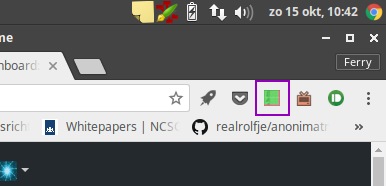

% Pandoc example document
% Ferry Boender
% October 16, 2017

## About

This is an example document for Pandoc. It includes most relative things such
as headings, tables, preformatted text, etc.

Lorem ipsum dolor sit amet, consectetur adipiscing elit. Ut at nisl sed purus
rutrum suscipit id at nibh. Morbi tempor laoreet felis non semper. Sed nunc
libero, accumsan consequat nunc nec, tempor dignissim elit. Aenean nec velit
mollis, blandit lectus in, ultrices urna. Class aptent taciti sociosqu ad
litora torquent per conubia nostra, per inceptos himenaeos. In hac habitasse
platea dictumst. Aliquam pulvinar sed ante et aliquam.

Sed id arcu nec magna placerat facilisis. Mauris eget facilisis libero. Etiam
non nisi urna. Vestibulum maximus neque ac est placerat, eget ultrices sem
elementum. Vivamus ac porttitor lacus. In hac habitasse platea dictumst.
Suspendisse laoreet id sapien ac eleifend. Suspendisse luctus eleifend
pharetra. Nulla facilisi. Ut vitae erat at quam pulvinar euismod. Fusce
aliquam urna a lectus commodo pharetra sit amet vitae sapien. Nunc suscipit
dui ac odio efficitur, ac euismod est aliquet.

## Some example elements

This chapter shows some example elements.

### Tables

The following is a table.

Sed id arcu nec magna placerat facilisis. Mauris eget facilisis libero. Etiam
non nisi urna. Vestibulum maximus neque ac est placerat, eget ultrices sem
elementum. Vivamus ac porttitor lacus. In hac habitasse platea dictumst.

  Right     Left     Center     Default
-------     ------ ----------   -------
     12     12        12            12
    123     123       123          123
      1     1          1             1

Morbi tempor laoreet felis non semper. Sed nunc
libero, accumsan consequat nunc nec, tempor dignissim elit. Aenean nec velit
mollis, blandit lectus in, ultrices urna.

So that's neat. What else?

### Code / preformatted text

A small code snippet:

	fboender @ jib ~/Projects/fboender/umatrix_tutorial $ make
	pandoc -s -S --toc -c index.css umatrix_tutorial.md -o umatrix_tutorial.html
	#pandoc -s -S --toc -H ../index.css umatrix_tutorial.md -o umatrix_tutorial.html

### Images

We can also include images.

### Lists

Lists are, naturally, also possible. Both bullet and numbered lists.

1. This is the **scope selector**. It determines on what level (global,
   domain, subdomain) blocking and unblocking elements has an effect.
   Basically this lets you set defaults for all websites or specific websites.
2. **Disable / enable matrix filtering**. This toggles blocking of all
   requests for the current scope.
3. **Option toggles**, such as turning on and off User Agent spoofing.

A bullet list:

* **light-red**: The resource is blocked by default.
* **dark-red**: The resource has been manually set to be blocked. Dark-red
  in the domain column (the first one) means that website is being blocked by
  a block list.
* **light-green**: The resource is allowed by default.
* **Dark-green**: The resource has been manually set to be allowed.

## Conclusion

Pandoc is pretty neat!  Lorem ipsum dolor sit amet, consectetur adipiscing
elit. Ut at nisl sed purus rutrum suscipit id at nibh. Morbi tempor laoreet
felis non semper. Sed nunc libero, accumsan consequat nunc nec, tempor
dignissim elit. Aenean nec velit mollis, blandit lectus in, ultrices urna.
Class aptent taciti sociosqu ad litora torquent per conubia nostra, per
inceptos himenaeos. In hac habitasse platea dictumst. Aliquam pulvinar sed
ante et aliquam.
