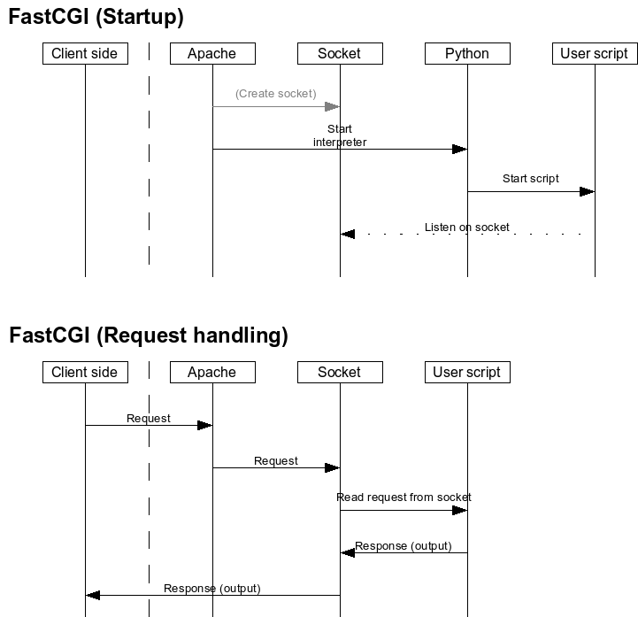
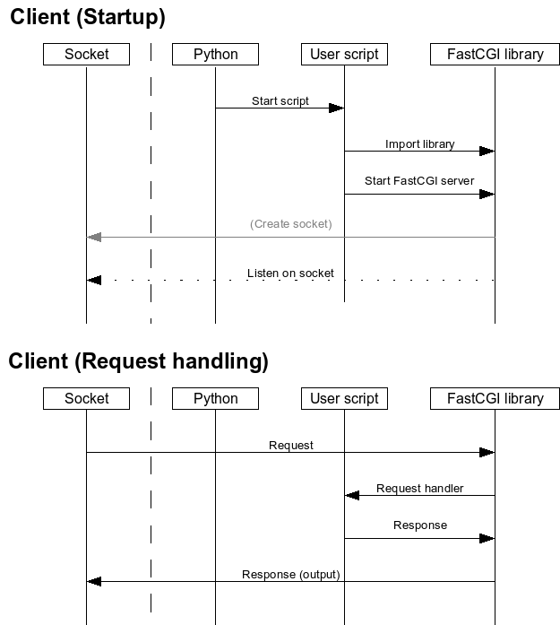

% Apache, FastCGI and Python
% Ferry Boender
% Ocotber 16 2017

## Preface

FastCGI is a hybrid solution to serving web applications written in a wide
variety of programming languages. It sits somewhere between CGI, which spawns
a new instance of the web application for each request, and the various web
server modules (such as mod_php, mod_python and mod_wsgi) which take care of
pre-spawning a pool of interpreters and web applications from within the web
server, which will then handle requests. 

FastCGI, too, can take care of spawning a pool of web application instances to
handle requests. It can also facilitate communications between a web server
and an external, already running web application. Unlike CGI, FastCGI does not
spawn a new process for each request, and unlike the various web server
modules it is not completely embedded within the web server. Instead it uses
TCP/IP or Unix sockets to communicate to the web application. This makes it
possible to create advanced setups such as spreading out requests over
multiple servers, limiting web applications' rights and system resources using
the standard Unix tool-set, etc.

FastCGI is available for a large range of web servers, is fast and is powerful
and versatile in its capabilities. It is however not well documented, nor easy
to set up. This document covers the basic idea behind FastCGI, setting up
FastCGI for Apache (v2) and hooking it up to a simple Python web application.
Such a light-weight setup, which requires nothing more than a FastCGI Python
library, can provide an alternative Python web development environment for
people who feel that the Python web development frameworks (Django, Pylons,
TurboGears and even Web.py) are too bloated.

## For the lazy

This chapter is for the lazy, those in a hurry and those who just want to get
things running. It is much less in-depth, and if anything fails, you'll have
to read the rest of this document. It also only covers the Static FastCGI
mode. If you have no idea what that means... hey, I'm not the lazy one. Read
the rest of this document ;-)

Assumptions:

* You are using Debian/Ubuntu.
* The Document Root is `/var/www/test/htdocs`.
* The web server runs as user `www-data`, group `www-data`.
* You will be running in static FastCGI mode.

Here we go:

Install Apache mod_fastcgi and enable it. For Debian/Ubuntu:

    # apt-get install libapache2-mod-fastcgi
    # a2enmod fastcgi

Modify your Virtual Host configuration:

    <VirtualHost *:80>
        ServerName test

        DocumentRoot /var/www/test/htdocs/
        <Directory />
            Options `FollowSymLinks `ExecCGI
            AllowOverride All
        </Directory>

        <Files app.py>
            SetHandler fastcgi-script
        </Files>

        FastCgiServer /var/www/test/htdocs/app.py -processes 4 -socket /tmp/fcgi.sock 
    </VirtualHost>

Install Flup, which contians a Python FastCGI server library:

    # pip install flup

Create a file `/var/www/test/htdocs/app.py`, and put the following in it:

    #!/usr/bin/python

    from flup.server.fcgi import WSGIServer

    def app(environ, start_response):
        start_response('200 OK', [('Content-Type', 'text/html')])
        return('''<html>
        <head>
             <title>Hello World!</title>
        </head>
        <body>
             <h1>Hello world!</h1>
        </body>
    </html>''')

    if __name__ == "__main__":
        WSGIServer(app, bindAddress = '/tmp/fcgi.sock').run()

Change its permissions and ownership/group:

    # chmod 755 /var/www/test/htdocs/app.py
    # chown www-data:www-data /var/www/test/htdocs/app.py

Make sure no old sockets remain:

    # rm /tmp/fcgi.sock

Restart Apache:

    # /etc/init.d/apache2 restart

Surf to `http://test/app.py`.

You should now see the `Hello World!` message. If not, check the
'Troubleshooting' chapter, of read the rest of this document for help on
troubleshooting FastCGI problems.

## FastCGI basics

Time to cover some basics. You will need an understanding of how FastCGI
works, in order to make educated guesses about problems during setup.

### CGI v.s. FastCGI

Let's look at standard CGI, and how it works. 

In figure 1, we see the flow of a request for a CGI script from the
client-side. Apache receives the request, starts the appropriate interpreter
(in our case Python), and passes the request information to the Python script
as parameters and through the shell environment. The scripts reads this
information, act accordingly and responds to Apache by writing information to
its Standard Output file descriptor. Apache takes this information and creates
an appropriate response to send to the client-side.

Now let's look at FastCGI.

When Apache starts, FastCGI determines which mode it should run in (more on
these later):

* Dynamic
* Static
* External

FastCGI then sets up communication methods if required (for instance, a
socket) and starts zero, one or more instances of your FastCGI application.
This, again, depends on the mode it runs in. The FastCGI application then also
determines which mode it is running in, and sets up communications with the
FastCGI server.

As soon as a request comes in, FastCGI parses the request and passes the
request information to the application. The Python script reads the request
from FastCGI and handles it. It responds to Apache by writing information to
the socket/Standard Out. Apache takes this information and creates an
appropriate response to send to the client-side. Meanwhile, the script starts
listening on the socket for the next request.

As you can see, in the FastCGI scenario the interpreter(s) only has to be
started once; when Apache is started. The web script stays alive, and
processes requests from the socket directly. Not having to start a new
interpreter for each request means means a lot of startup overhead is removed.

### FastCGI modes of operation

mod_fastcgi in Apache can operate in three modes:

* Dynamic
* Static
* External

In the **Dynamic** mode, FastCGI spawns a process manager (PM) and FastCGI will
then wait for incoming connections. As soon as a connection comes in, it
spawns the Python interpreter which will start your script. Depending on the
configuration, the started application may then be used to handle other
requests, or it will be killed off by the PM. The PM may start more than one
instance of your program if more connections come in.

In **Static** mode, Apache's FastCGI spawns a PM at startup, which takes care of
spawning the Python interpreters (which, in turn, start your web application).
The PM will start a fixed (but configurable) amount of Python interpreters to
handle requests.

In the **External** mode, FastCGI does nothing to start your Python web
application. It assumes it is already started. This is more a kind of proxying
mode, and your script will have to take care of spawning multiple processes or
threads itself.

### FastCGI methods of communicating

Next to those three modes of operating, mod_fastcgi can communicate with your script in three distinct ways:

* STDIN Socket
* Domain Socket
* TCP/IP Socket

The **STDIN Socket** method is used in Dynamic mode. FastCGI communicates with
your application using the Standard In (STDIN) file descriptor of your
application, which should be transformed to a socket by your Python FastCGI
library.

The **Domain Socket** method can be used in both Static and External mode.
FastCGI will communicate using a named unix domain socket on the filesystem
(`/tmp/fcgi.sock` by default, but this depends on the
[FastCgiIpcDir](http://www.fastcgi.com/mod_fastcgi/docs/mod_fastcgi.html#FastCgiIpcDir)
configuration directive and other settings). A domain socket is a special file
to which two processes can both connect. Anything sent to the socket is then
received by the other process. Domain sockets are faster than TCP/IP sockets,
as they incur much less overhead. In Static mode, the PM will automatically
create the socket. In External mode, the socket will not be created by the PM,
but is assumed to already exist. This is because your external FastCGI web
application is already supposed to run, and it should have created the socket
itself. FastCGI merely connects to it.

The **TCP/IP Socket** method unsurprisingly uses a TCP/IP socket to connect to
the application, and can be used by the Static and External methods. All one
has to do is specify the `-host` option (External), or the `-port` (Static)
option. Communicating with a web application on a remote host is only possible
in External mode.

Here's a small recap of the run modes and communication methods:

           STDIN Socket   Domain Socket   TCP/IP Socket  Remote app  PM starts app
---------  ------------   -------------   -------------  ----------  -------------
Dynamic    Y              N               N              N           Y
Static     N              Y               Y              N           Y
External   N              Y               Y              Y           N

### Client internals

Figure 3 shows what the flow looks like inside the actual FastCGI Python web application:

When running in Static/Dynamic mode, Apache/FastCGI will start several
interpreters to handle your request. In External mode, you should start the
application yourself. Once the application starts, it loads the FastCGI Python
library, which will create a socket (or transform STDIN to a socket) if
required and starts to listen on it for incoming requests.

For each incoming request, the FastCGI Python library reads the request, does
some housekeeping, and then passes the request to your application's request
handler. The request handler then further handles the request, and returns a
response, which the FastCGI library will return to Apache/FastCGI through the
socket.

## Setup

Now that you understand the basic workings of FastCGI, it is time to move on
to setting it up. This chapter will discuss how to setup FastCGI, and how to
debug it.

### Install and prepare FastCGI

The first thing to do is to install the FastCGI Apache module. 

For Debian and Ubuntu machines, this is as easy as:

    # apt-get install libapache2-mod-fastcgi

For other Operating Systems, look for an Apache FastCGI package in your
package repository and install it. If no package exists for your OS, you can
[download](http://www.fastcgi.com/dist/) and compile the FastCGI module yourself
for Apache. Look in the `docs/` directory within the archive for instructions.

Make sure the module is enabled in apache:

    # a2enmod fastcgi
    This module is already enabled!

Now edit a virtual host configuration file to enable CGI programs. You will
have to look for a `<Directory />` directive (or some other `<Directory >`
directive), and modify it. Let's assume our virtual host configuration is
defined in `/etc/apache2/sites-available/test` and looks like this:

    DocumentRoot /var/www/test/htdocs/

    <Directory />
        Options FollowSymLinks
        AllowOverride All
    </Directory>

Change the `Options` setting, and add `+ExecCGI` to it, resulting in:

    DocumentRoot /var/www/test/htdocs/

    <Directory />
        Options FollowSymLinks +ExecCGI
        AllowOverride All
    </Directory>

This enables CGI execution for scripts in or below the root web directory of
the virtual host. In my setup, this is `/var/www/test/htdocs/`. This doesn't
yet mean that any script below that directory will be handled as a FastCGI
script. We'll come to that later. Now restart Apache:

    # /etc/init.d/apache restart

You can verify that FastCGI is working properly by looking for a running
process named `fcgi-pm`:

    # ps auxf | grep fcgi-pm
    www-data 32767  0.0  0.2  S    21:39   0:00  \_ /usr/sbin/fcgi-pm -k start

You should see a line similar to the last one in the output of that command. 

### Setup a FastCGI script

Before we can continue our FastCGI setup, we need an actual FastCGI
application. For this article, we'll create our own simple application. The
application you may be trying to get to work with FastCGI might be completely
different. In that case, consult the appropriate documentation for setting up
that application with FastCGI, or simply continue with this example script so
you at least know FastCGI is working properly.

Okay, install Flup, which is a bunch of different wrappers around WSGI
servers. Amongst them is a a Python FastCGI server library.

    # pip install flup

Alternatively, if you don't have (or want) pip, you can just download it from
[https://pypi.python.org/pypi/flup/1.0](https://pypi.python.org/pypi/flup/1.0).

Create a new file `/var/www/test/htdocs/app.py`, and put the following in it:

    #!/usr/bin/python

    from flup.server.fcgi import WSGIServer

    def app(environ, start_response):
        start_response('200 OK', [('Content-Type', 'text/html')])
        return('''<html>
        <head>
             <title>Hello World!</title>
        </head>
        <body>
             <h1>Hello world!</h1>
        </body>
    </html>''')

    if __name__ == "__main__":
        WSGIServer(app, bindAddress = '/tmp/fcgi.sock').run()

*Important*: The last line of the script will 'need to be changed for each
different mode you wish to run in'! What the line should be will be explained
further along.

*Important*: Correct the ownership and permissions for the file `app.py`. The
file should be owned by the web server user (`www-data` on Debian/Ubuntu
systems) and should be executable by the web server user (Mode `755`):

    # chown www-data:www-data /var/www/test/htdocs/app.py
    # chmod 755 /var/www/test/htdocs/app.py

Test the script by running it on the command-line:

    # /var/www/test/htdocs/app.py

The application will now create a socket at `/tmp/fcgi.sock` if it does not
exist already and start its main loop. It will then wait for connections to
the socket and handle them. *Make sure the application shows no errors, and
that the socket at `/tmp/fcgi.sock` exists*. The application will not exit
automatically, as it is waiting for requests. It is supposed to do this.

Now you can stop the application by pressing Ctrl-C. After stopping the
application *you have to remove the created socket*, or you will run into
problems later on:

    # rm /tmp/fcgi.sock

If everything worked as expected, we can now continue to set up FastCGI so
that it will call your script.

### Setup FastCGI to handle the script

We can't actually call any scripts yet, since we haven't let FastCGI know what
it should run and how it should run it. So first we'll tell FastCGI which
scripts it should treat as FastCGI scripts. Edit the virtual host
configuration again, and add the following section:

    <Files app.py>
        SetHandler fastcgi-script
    </Files>

This tells FastCGI that the script `app.py` in the document root
(`/var/www/test/htdocs`) is a FastCGI script. Now all that remains is to tell
FastCGI how it should handle this script. As you've read earlier in this
document, there are various ways of running FastCGI applications: Static mode,
Dynamic mode, and External mode.

#### Dynamic mode

For *Dynamic* mode, you will have to change the last line of `app.py` to:

    fcgi.WSGIServer(app).run()

This is basically all you have to do. You should now be able to call your
application at the url `http://test/app.py`. FastCGI will spawn an interpreter
once a request comes in, and your application should handle it.

#### Static mode with socket

In static mode with a socket, FastCGI's Process Manager creates a socket and
then spawns a fixed amount of Python interpreters and scripts. The number of
interpreters will not change, even if there are more requests than the amount
can handle. The number of interpreters started depends on the `-processes`
parameter value. The default is *one* interpreter. If you want the script to
be run in static mode, first change the last line of `app.py` to:

    WSGIServer(app, bindAddress = '/tmp/fcgi.sock').run()

Now, add the following to the virtual host configuration:

    FastCgiServer /var/www/test/htdocs/app.py -processes 4 -socket /tmp/fcgi.sock

Restart Apache, and it should automatically spawn four instances of your
application. There may be a slight delay before all four processes have been
started. You can check that things are correct by issuing the following
command:

    # ps axf
     ...
     7746 ?        Ss     0:00 /usr/sbin/apache2 -k start
     7747 ?        S      0:00  \_ /usr/sbin/fcgi-pm -k start
     7748 ?        S      0:00  |   \_ /usr/bin/python /var/www/test/htdocs/app.py
     7758 ?        S      0:00  |   \_ /usr/bin/python /var/www/test/htdocs/app.py
     7760 ?        S      0:00  |   \_ /usr/bin/python /var/www/test/htdocs/app.py
     7761 ?        S      0:00  |   \_ /usr/bin/python /var/www/test/htdocs/app.py
     7753 ?        S      0:00  \_ /usr/sbin/apache2 -k start
     7754 ?        S      0:00  \_ /usr/sbin/apache2 -k start
     7755 ?        S      0:00  \_ /usr/sbin/apache2 -k start
     7756 ?        S      0:00  \_ /usr/sbin/apache2 -k start
     7757 ?        S      0:00  \_ /usr/sbin/apache2 -k start

You can now point your browser to the URL `http://test/app.py` (in our case),
and you should see the `Hello World!` message.

#### Static mode with port

In Static mode with a port, FastCGI's PM spawns a fixed amount of Python
interpreters. To run in Static mode with a port, change the last line of
`app.py` to:

    WSGIServer(app, bindAddress = ('127.0.0.1', 8080)).run()

You may want to change the port, but you shouldn't change the IP, or your
application will be available to the entire network. Since Static mode does
not support remote hosts anyway, this is an avoidable security issue.

Next, add the following to the virtual host configuration:

    FastCgiServer /var/www/test/htdocs/app.py -processes 4 -port 8080

And restart Apache. You can now point your browser to the URL
`http://test/app.py` (in our case), and you should see the `Hello World!`
message.

#### External mode with socket

In the external mode, we must first shut down Apache, and make sure the socket
is no longer on the filesystem, or our application will not be able to
properly connect to it:

    # /etc/init.d/apache2 stop
    # rm /tmp/fcgi.sock

Next, change the last line of `app.py` to:

    WSGIServer(app, bindAddress = '/tmp/fcgi.sock').run()

Now, we modify our Apache virtual host configuration, and add the following
line:

    FastCgiExternalServer /var/www/test/htdocs/app.py -socket /tmp/fcgi.sock

Before we start our application, we have to make sure we are running it as the
same user as our web server. In our case, this is `www-data`, so we must su to
www-data, or the web server will not be able to connect to our socket, and
will receive a `Permission Denied` error.

Now we start our application:

    # su - www-data
    $ /var/www/test/htdocs/app.py

Next we start Apache:

    # /etc/init.d/apache2 start

We can now open the URL in our browser: `http://test/app.py`, and we should
see the `Hello World!` message.

#### External mode with hostname/port

In the external mode with hostname/port, we must first shut down Apache, and
make sure the socket is no longer on the filesystem, or our application will
not be able to properly connect to it:

    # /etc/init.d/apache2 stop
    # rm /tmp/fcgi.sock

Next, change the last line of `app.py` to:

    WSGIServer(app, bindAddress = ('10.1.1.1', 8080)).run()

Change the IP and port to the IP of the machine which will run your
application and the port on which your application will run on.

Now we start our application on the remote host:

    # su - www-data
    $ /var/www/test/htdocs/app.py

Next we start Apache:

    # /etc/init.d/apache2 start

We can now open the URL in our browser: `http://test/app.py`, and we should
see the `Hello World!` message.

## Troubleshooting

### Generic troubleshooting

There are basically two best ways to troubleshoot FastCGI problems. The first
is to check if the FastCGI application you are trying to run actually works.
If there are syntax errors in the script, or if the interpreter cannot be
found, there will be no error logging, so be careful in making sure the script
is correct.

If running in Static/Dynamic mode, make sure Apache and the script are not
running. Now start Apache, and verify that the socket `/tmp/fcgi.sock` is
correctly created:

    # ls -la /tmp/fcgi.sock
    srwxr-xr-x 1 www-data www-data 0 Feb  2 17:34 /tmp/fcgi.sock

If the socket is not being created, FastCGI may not have been setup correctly.

Also check that FastCGI has spawned the Process Manager and at least one
instance of your script (Static/Dynamic mode):

    # ps auxf
    ..
     6928 ?        Ss     0:00 /usr/sbin/apache2 -k start
     6929 ?        S      0:00  \_ /usr/sbin/fcgi-pm -k start
     6933 ?        S      0:00  |   \_ /usr/bin/python /var/www/test/htdocs/app.py
     6934 ?        S      0:00  \_ /usr/sbin/apache2 -k start
     6935 ?        S      0:00  \_ /usr/sbin/apache2 -k start

If the Process Manager (`fcgi-pm` process) is not running, something is wrong
with either your FastCGI installation or the `FastCgiServer` or
`FastCgiConfig` directive.

If running in External mode, verify you are running the script as the proper
user:

    # ps auxf | grep apache
    www-data  7605  0.0  0.2  0:00  \_ /usr/sbin/apache2 -k start

    # ps auxf | grep app.py
    www-data  7911  0.2  0.3  0:00                      \_ /usr/bin/python ./app.py

Before running the script, make sure there is no socket file in
`/tmp/fcgi.sock`. Start your script, and verify that it has created the socket
with the correct persmissions and ownerships:

    # ls -la /tmp/fcgi.sock
    srwxr-xr-x 1 www-data www-data 0 Feb  2 17:34 /tmp/fcgi.sock

The owner and group should match the username and group of the Apache
sub-processes and the socket permissions should allow reading and writing from
and to the socket by both the Apache user, and your application.

### Common logfile errors

FastCGI does its best to log errors to the various log files when problems
occur. Errors end up in the custom log file for your virtual host (if defined)
or in the global error log (`/var/log/apache/error.log`). If you can't find
any errors, but your application still fails, check every log file you can for
possible clues.

Sometimes the errors FastCGI logs are rather cryptic. Here are some of the
more common errors, and how to possibly resolve them.

    (13)Permission denied: FastCGI: failed to connect to server
    "/var/www/test/htdocs/app.py": connect() failed

    FastCGI: incomplete headers (0 bytes) received from server
    "/var/www/test/htdocs/app.py"

FastCGI cannot connect to the application socket because it does not have the
correct ownership or permissions. This usually happens in external mode, when
the application you are trying to run creates the socket itself. Make sure you
are running the application as the web server user and that the web server can
read and write from and to the socket. Sometimes the socket will not be
removed by Apache or your application, and it will have the wrong permissions.
Your application can't overwrite the socket with a correct one, and fails
silently. Make sure to remove any socket files before starting Apache:

    No such file or directory: FastCGI: failed to connect to server
    "/var/www/test/htdocs/app.py": connect() failed

FastCGI tried to start the script you gave as a parameter to the
`FastCgiServer` or `FastCgiExternalServer` directive, but it did probably does
not exist, or couldn't be started correct. 

    FastCGI: "ExecCGI Option" is off in this directory: /app.py

The ExecCGI option has not been enabled for the directory in which you are
trying to run the script. Make sure you have enabled it (see chapter 'Install
and Prepare FastCGI').

    FastCGI: server "/var/www/test/htdocs/app.py" stderr: SOME TEXT

There is something wrong with your script, and this is its output. Fix the
script.

    FastCGI: comm with (dynamic) server "/var/www/test/htdocs/app.py" aborted:
    (first read) idle timeout (30 sec)

For some reason FastCGI was not able to communicate with your Python script.
Possible reasons include a faulty socket (write permission denied or wrong
ownership or group), failure in your script to correctly read from the socket
or incorrect reading from the socket.

## Introduction to Python development via FastCGI

### WSGI

Now that we've set up FastCGI, we can use the default Python cgi module to
handle stuff for us in much the same way as we could a normal CGI program. The
only difference is that our environment isn't passed in through the normal
Operating System environment, but through the `environment` parameter. The
other parameter our main method receives is the `start_response` parameter. As
we've seen, our main method looks like this:

    def app(environ, start_response):
         start_response('200 OK', [('Content-Type', 'text/html')])
         return('SOME OUTPUT')

This method is known as a WSGI middleware, because it's function definition
has the `environ` and `start_response` parameters. You can find a whole range
of middleware functions on the Internet, from error handling to complete form
parsing middleware. The various Python web development frameworks also offer a
lot of interesting middleware, much of which can easily be ripped out of the
frameworks they come with and be reused in your own application. This way you
can mix and match your own custom framework for exactly that goal you had in
mind.

Some of the more interesting middlewares and frameworks that offer nice
middleware are:

* **Paste** [http://pythonpaste.org](http://pythonpaste.org/): Paste is a
  collection of WSGI middleware which can be used to build your own framework.
  The Pylons framework (http://pylonshq.com/) uses Paste at its core. You can
  re-use parts of Paste if you want to build your own framework.
* **WebOb** [http://pythonpaste.org/webob/](http://pythonpaste.org/webob/):
  WebOb provides objects for HTTP requests and responses. Specifically it does
  this by wrapping the WSGI request environment and response
  status/headers/app_iter(body). The request and response objects provide many
  conveniences for parsing HTTP request and forming HTTP responses.
* **Beaker** [http://beaker.groovie.org/](http://beaker.groovie.org/): Beaker
  is light WSGI middleware layer that provides sessions.
* **Werkzeug** [http://werkzeug.pocoo.org/](http://werkzeug.pocoo.org/):
  Werkzeug started as a simple collection of various utilities for WSGI
  applications and has become one of the most advanced WSGI utility modules.
  It includes a powerful debugger, full featured request and response objects,
  HTTP utilities to handle entity tags, cache control headers, HTTP dates,
  cookie handling, file uploads, a powerful URL routing system and a bunch of
  community contributed addon modules.

You can find a whole collection of WSGI middleware at
http://wsgi.org/wsgi/Middleware_and_Utilities.

### Basic handling

If you do not want to rely on heavy framework middleware, you can easily use the CGI module that comes with Python to do basic web development. A quick example:

    def app(environ, start_response):
        remote = cgi.FieldStorage(environ['wsgi.input'], environ=environ)

        name = 'Doe'
        if 'name' in remote:
            name = remote.get_first('name')

        start_response('200 OK', [('Content-Type', 'text/html')])

        return('Hello. Your name is %s' % (cgi.escape(name)))

    WSGIServer(app, bindAddress = '/tmp/fcgi.sock').run()

If we now enter the URL `http://test/app.py?name=John`, our example will output:

    Hello. Your name is John

## Further reading

Here are some links to documents relevant to Apache mod_fastcgi and other assorted FastCGI readings:

* [http://www.fastcgi.com/mod_fastcgi/docs/mod_fastcgi.html](http://www.fastcgi.com/mod_fastcgi/docs/mod_fastcgi.html)\
  Apache mod_fastcgi documentation. Contains a fairly nontransparent
  description of how FastCGI works, but also has valuable documentation on the
  parameters for each Apache directive.
* [http://www.fastcgi.com/devkit/doc/fcgi-spec.html](http://www.fastcgi.com/devkit/doc/fcgi-spec.html)\
  The official FastCGI Specification. This does a reasonable job of explaining
  how FastCGI works, but it does not explain all the different modes that
  Apache's mod_fastcgi can run in. It is also rather technical (and you
  thought this document was already too technical didn't you?).
* [http://www.fastcgi.com/docs/faq.html](http://www.fastcgi.com/docs/faq.html)\
  The FastCGI Frequently Asked Questions.
* [http://www.fastcgi.com/drupal/node/6](http://www.fastcgi.com/drupal/node/6)\
  FastCGI documentation index.

## About this document

### Copyright / License

Copyright (c) 2008-2017, Ferry Boender

    This document may be freely distributed, in part or as a whole, on any
    medium, without the prior authorization of the author, provided that this
    Copyright notice remains intact, and there will be no obstruction as to
    the further distribution of this document. You may not ask a fee for the
    contents of this document, though a fee to compensate for the distribution
    of this document is permitted.

    Modifications to this document are permitted, provided that the modified
    document is distributed under the same license as the original document
    and no copyright notices are removed from this document. All contents
    written by an author stays copyrighted by that author.

    Failure to comply to one or all of the terms of this license automatically
    revokes your rights granted by this license

    All brand and product names mentioned in this document are trademarks or
    registered trademarks of their respective holders.

### Attributions

I extend my gratitude to the following people who helped during the writing of this document:

* **Michiel van Baak** for proof-reading.
* **Stephan Ubbink** for proof-reading.
* **Aram Versteeg** for proof-reading.

### Feedback

All feedback on this document is welcome at <ferry DOT boender AT gmail DOT com>.
