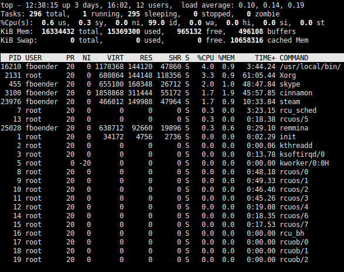
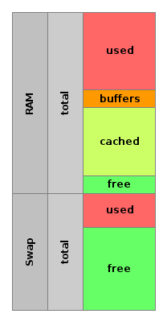
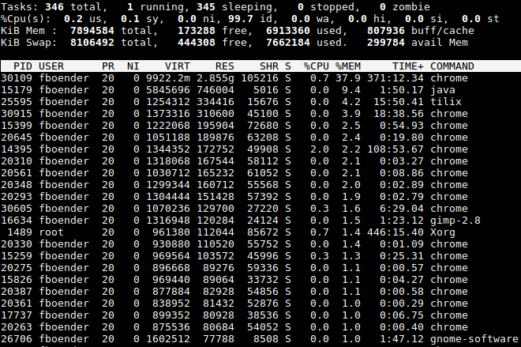
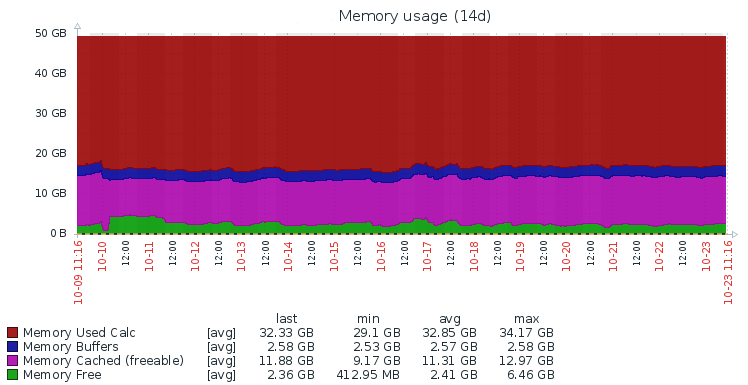
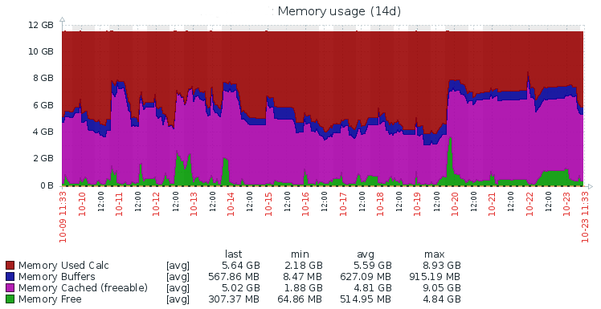
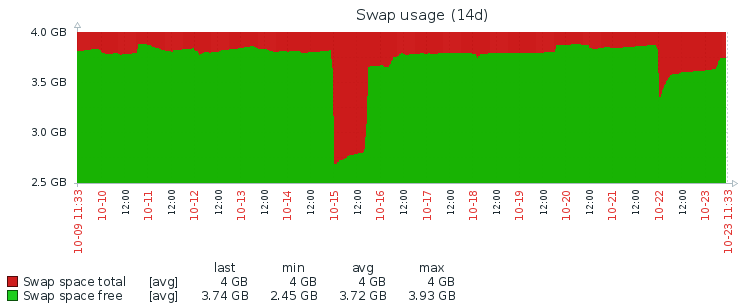

% Linux Troubleshooting Guide
% Ferry Boender
% October 16, 2017

Preface
-------

Troubleshooting problems on Linux systems can be a daunting task. There are a
multitude of tools and concepts to understand. Problems may be related to
memory, disk, networking or applications themselves. This guide tries to cover
the basics of troubleshooting on Linux. It covers basic guidelines for
troubleshooting, how to gather data and what that data means and gives
specific pointers on how to figure out what is going wrong on your machine.

The Art Of Troubleshooting
--------------------------

### The Science of Troubleshooting

Troubleshooting is basically science:

1. **Make observations**: First, we make observations. What error message are
   we getting? What application does the error come from, which user, what
   browser, what network location, etc. This includes reproducing the problem
   to make it easier to find out and fix the problem. If the error is
   unfamiliar, you might for instance try to google it.\
   \
   For example, an application might complain about not being able to connect
   to a database with the error message "Connection timed out". We determine
   from where the application is trying to connect, and where it's trying to
   connect to.

2. **Hypothesis and prediction**: We construct a hypothesis based on our
   observations, knowledge and experience. This is often the trickiest part
   because our knowledge might be lacking, or worse: we may not have a clear
   picture of the problem at all. Sometimes its a matter of guesswork. An
   example of a hypothesis could be: "The connection is timing out because a
   firewall is dropping the network traffic".\
   \
   If we have a hypothesis, we can make predictions. If we suspect the
   firewall, we should be unable to connect to the service from one location,
   but we should be able to connect from, say, the local network. Or we
   should be able to connect if we disable the firewall.

3. **Perform an experiment**: Next we test our prediction through
   experimentation. For instance, we disable the firewall and try to connect
   to the service again. If its still not working (and we're sure we've
   properly disabled the firewall), we can conclude that the firewall is not
   the problem.

We repeat these steps until we've identified the problem and solution. This
may mean we have to add additional instrumentation to make better observations
before we can properly diagnose a problem. For example, we may turn on debug
logging in an application so we can better diagnose the problem next time it
happens.

### Working from First Principles

According to Wikipedia:

> A first principle is a basic, foundational, self-evident proposition or
> assumption that cannot be deduced from any other proposition or assumption.

When troubleshooting a problem, its extremely important to work from First
Principles. In other words, we have to remove as much of the assumptions we
generally make and stay as close to the "truth" as we can.

Let's say we're troubleshooting a network problem. We have three networks: A,
B and C. There's a service on network A that can't connect to a service on
network C. Our assumptions might trick us into thinking the problem is with
network C and so we test connectivity from network C or B. But the *actual*
problem might be with network A, in which case everything might appear to work
fine from the point of view of network B and C. Or even worse, we also see the
problem on network B, but it's not actually the same problem!

Another good example is Cron jobs. We write a shell script to clean up some
outdated files, test it in the shell and all seems to be working fine. But
when we run it from cron, it suddenly fails! This is because we assumed that
the environment that cron is using is the same as the one our shell is using.
But that's an incorrect assumption. Cronjobs have a very different
environment. For instance, it may not have a `HOME` env var set, or the `PATH`
may lack `/usr/sbin`.

If you cannot reproduce a problem or find its cause, there's a good chance
that you've made a wrong assumption somewhere. It's often easiest (and
quickest) to return to first principles. I.e. start over at the beginning.

### Reproducibility

One of the best ways of troubleshooting a problem is being able to reproduce
it. If we can see the problem happening for ourselves, we can easily inspect
things, tweak settings and make changes until the problem disappears.

Before being able to reproduce a problem, we often need to gather more data
or try some experiments. We might have to ask the user for some more
information and instruct them in how to obtain that information. Do not
hesitate to invest time into reproducing a problem.

If you're not able to reproduce the problem, and the problem isn't easy, then
you're going to have an extremely hard time finding and fixing the problem.
And it will be impossible to test whether you've fixed it.

### Emulate

It is often necessary to emulate the environment in which the problem is
occurring, in order to reproduce it. You should always do this as closely to
the real environment as you can. Refuse the temptation to cut corners here!
That will just cost more time in the long run.

Emulating environments is a bit of an art itself. It takes a fair amount of
knowledge of the environment to do this. For instance, in the case of Cron
jobs failing, you have to be aware that Cron uses a different Environment as
normal shells, and it generally also uses a different shell than your normal
session does.

Let's look at a few examples:

A web application is complaining that it can't write to a file. The web
application runs under the Apache webserver which runs as user `www-data`. You
check the permissions on the directory, and the `www-data` user which the does
have rights to write in that directory. 

    root # ls -la /var/www/mywebsite/attachments/2017
    total 24
    drwxr-xr-x  6 www-data www-data 4096 Oct 21 14:23 .
    drwxr-xr-x 13 www-data www-data 4096 Jan 11  2017 ..

Now you're at a loss as to what the problem could be. The solution is to
emulate the environment the web application is running in. Change to the
`www-data` user using `su` and actually try to write something in the same
directory:

    root # sudo su - www-data
    www-data $ cd /var/www/
    root # cd website
    bash: cd website: Permission denied

Now you've reproduced the actual problem: The `www-data` user doesn't have
permission to view `/var/www/mywebsite/` directory.

Another example:

An application is complaining that it can't connect to the MySQL database
server:

    ERROR 1045 (28000): Access denied for user 'web'@'localhost' (using password: YES)

You look up the settings its using:

    host=127.0.0.1
    port=3306
    user=web
    password=s3cr3t

You try to connect to the database:

    mysql -u web -p -h localhost
    Enter password: s3cr3t
    mysql>

That's weird, it seems to be working for us just fine? But look at the host
we're connecting to. We're using `localhost`, while the web app is using
`127.0.0.1`. "But those are the same, aren't they?", I hear you think. But
MySQL treats `127.0.0.1` and `localhost` differently. If it sees `localhost`
it will try to connect through a socket (usually in
`/var/run/mysqld/mysqld.sock`), but if it sees `127.0.0.1`, it will try to
connect through the network stack. So we try again:

    mysql -u web -p -h 127.0.0.1
    Enter password: s3cr3t
    ERROR 1045 (28000): Access denied for user 'web'@'localhost' (using password: YES)

Now we've reproduced the problem, and we can figure out why it's not working
properly. In this case, MySQL needs to be reconfigured to listen on the
network instead of a socket. Side-note: MySQL still reports us as connecting
from "localhost". This is because `127.0.0.1` is resolved into `localhost`
when MySQL display the error. I consider this a bug in MySQL.

The lesson here is to always emulate as closely as possible what is happening.
Later on in this guide we'll learn more about what makes up an applications
environment and how to reproduce that.

### Tips

Some tips:

Knowledge is power:

* Know what you're looking at. You'll need a decent amount of knowledge on how
  operating systems work and what information your tools are actually showing
  you. If you think a high load means your CPUs are busy, you need to brush up
  on your knowledge ;-)
* More data means more insight. If all you have is the load average, it's
  going to be hard to pin down the problem. If, however, you have graphs of
  historic CPU, memory, swap and disk I/O usage going back three months, it's
  going to be a lot easier to see if problems are recurring at, for example,
  the same time each month.

Top down or bottom up?

* It's nearly always wrong to start somewhere in the middle.
* If a problem is application specific, start from the bottom up. E.g. look at
  the log files for that application to see if there are any errors.
* If a problem is vague or feels like it may be hard to pin down (e.g.
  multiple applications on different machines are suddenly slow), the best
  approach is a top-down approach. For example, look at network graphs for the
  entire network.

Reproducing problems:

* Ask the user for more details, such as actual error messages, screenshots,
  which software they're using and the exact steps they performed to get the
  problem. Ask the to try those steps again, because often the problem will
  disappear in a puff of smoke when they do.

* Make sure you're actually reproducing the problem you're trying to diagnose.
  Are you getting the exact same error message? Are you testing from the same
  location using the same software and steps as where the problem you're
  trying to diagnose is happening? Too often it seems you're reproducing a
  problem, but it turns out you're actually debugging a completely different
  thing.

The five elements of a computer
-------------------------------

### CPU

A computer has one or more CPUs. Tasks such as processes and threads are
scheduled by the kernel to be run on one of the CPUs. They are placed in a
queue and the task at the top of the queue gets to run for a bit on a CPU.
If there are multiple CPUs, more than one task can run at the same time. After
running for a few milliseconds, the kernel schedules the next task to be run
and puts the task that just ran at the back of the queue. This is called
preemptive multitasking and a single run on a CPU is called a 'slice'. 

If a task cannot continue executing, for instance because it needs to wait for
incoming data from the disk or network, it will tell the kernel and its time
slice will be cut short. A program that never instructs the kernel that it is
done before its time slice is over will consume 100% CPU time of a single CPU. 

There are many different ways in which tasks can be scheduled. There are
different schedulers and tasks can get higher priority in the queue than other
tasks. This is called a process `niceness`. Process niceness can be set with
the `nice` command.

The *load average* of a system gives us an indication about how busy the system
is. It does *not* necessarily show how busy the CPUs are! If a process keeps
requesting data from disk and then gives up it time share and is immediately
rescheduled for execution, the load average will show `1.0`, even though the
CPU may not really be doing anything at all and it's the disk activity that is
the problem. 

A load average of `1.0` usually means there is always one task waiting to be
executed. If you have only one CPU, that means one of the CPUs is constantly
getting tasks scheduled on it. That might still leave other CPUs available, so
a load of 1.0 might be just fine.

We can inspect the load average with the `uptime` command:

     $ uptime 12:27:22 up 3 days, 15:51, 12 users,  load average: 0.11, 0.20, 0.22

This shows us three load averages: `0.11`, `0.20`, and `0.22`. These are
averages over the last 1, 5 and 15 minutes. So for these values it means one
CPU has had a task scheduled on it for 1/5th of the time over the last 15 and
5 minutes, but over the last minute it's only had tasks scheduled on it about
1/10th of a single CPU. In other words, it's less busy now than it was for the
last 5 to 15 minutes. Note that the load might be spread out over multiple
CPUs, so load of 1.0 could mean that two processes have been keeping two CPUs
busy for 50% of the time.

A high load can indicate a few different things:

* One or more processes are consuming actual CPU time.
* One or more processes are constantly demanding data from the network or disk
* A misbehaving process is not giving up its slice, cause high load while it's
  not actually doing anything useful (infinite loop for example).

We can get more information on CPU usage through the `top` command:

    $ top

The `top` command shows a constantly updating view of basic system information
along with a list of processes. Included is information about the load, the
tasks, the CPU, memory and swap usage and a list of processes.

At the top of the output we see five lines. These display some time info and
the load averages, summaries about the number of tasks and which state they're
in, info about the CPU(s), information about the memory and information about
the swap usage.

The *`Tasks:`* line shows us how many processes are running, sleeping, stopped
and zombies. You'll want to see many sleeping processes here. Sleeping doesn't
mean these processes aren't running. They're not just not currently waiting to
be scheduled on the CPU. Stopped processes are those that have been put in the
background, for instance by pressing Ctrl-Z in the shell.

The *`CPU(s):`* line shows an aggregate of CPUs on a single line. You can
press the `1` key to show all CPUs separately. The numbers shown are
percentages (0-100):

* *us*: `User`: The amount of CPU used by user (non-kernel) processes that
  haven't been niced.
* *sy*: `System`: The amount used by system (kernel) processes.
* *ni*: `Nice`: The amount of CPU used by user (non-kernel) processes that
  have been niced.
* *id*: `Idle`: How much the CPU is not doing anything. This should always be
  100 minus the other `us`, `sy` and `ni` fields.
* *wa*: `I/O Wait`: The percentage of time the CPU was waiting for I/O to be
  completed.
* *hi*: `Hardware Interrupts`: The amount spent servicing hardware interrupts.
  Hardware interrupts are a signaling mechanism between hardware and the
  kernel. For example, the CPU will instruct a harddisk to read some
  information from disk. While its doing so, the CPU continues execution. When
  the reading from disk is done, the disk sends an interrupt to the CPU.
* *si*: `Software Interrupts`: The amount spent servicing software interrupts.
  Software interrupts are a signaling mechanism between the kernel and
  user-space software. Software interrupts are usually caused by the sending
  of signals.
* *st*: `Stolen`: Amount of CPU time stolen by the hypervisor. If you're
  running on a virtual platform and this number is high, other VMs or the host
  are stealing your CPU time.

There are a near infinite number of ways to interpret these numbers. Here are
a few of them:

If `us` and / or `ni` is high, it means one or more user applications are busy
on the CPU. Again, that doesn't have to mean they're actually busy crunching
numbers or other things we'd normally associate with CPU usage. If `hi` and /
or `si` are high, it means the applications are busy waiting for hardware such
as disks, memory, network or peripherals. If `wa` is high, processes are
waiting a lot for disk reads or writes.

So if we're seeing high `us`, low `wa` but high `hi`, it probably means the
application is busy with reading or writing from some piece of hardware that
is not a disk (network, for instance).

You can often get better insight by showing all CPUs (with the `1` key).

The fourth and fifth line show memory usage, which we'll go into in the
chapter.

### Memory

Memory usage is probably the most complex part of any Operating System.
*Nothing* you believe about memory usage is probably true. Memory management
on modern OS kernels is highly complex. 

For example, the kernel automatically assigns unused memory to processes that
might be able to use it for caching.  This may give the impression that we
have very little free memory. In reality, the kernel might take away assigned
memory from one process and give it to another if free memory becomes low.

Another thing that often throws people off is multiple of the same processes
(say, Firefox) all using a large amount of memory. In reality, much of that
memory may be shared between all the processes. It's difficult to say how
much.

We can view the current memory usage using the `free` command:

                 total       used       free     shared    buffers     cached
    Mem:          3.9G       3.5G       331M        65M       654M       1.6G
    -/+ buffers/cache:       1.3G       2.5G
    Swap:         4.0G       197M       3.8G

How do we read this output? Here's a rough schematic representation of how
memory usage works:

You'll notice immediately that the numbers from the `free` command do not add
up with the schematic representation, or even within the `free` command
itself. This is because some, but not all, of the `buffers`, `cached` and
`shared` memory may be counted against `used` memory. Remember, all of this is
an approximation! I cannot give you a definitive answer on how all of this is
calculated, because it changes with each kernel version and version of the
`free` tool. 

Let's look at the individual elements:

* **RAM**
    - **total**: This should speak for itself.
    - **used**: This is the amount of memory actually allocated by programs. That
      is, the programs explicitly asked the kernel for this memory. Say a program
      wants to read a 150 Mb text file into memory. This will increase `used` by
      150 Mb. It also includes some memory from the `buffers` and `cached`
      memory.
    - **free**: Memory that is completely and immediately free for use. This
      should be low, because unused memory in a system is a waste. It does **not
      have to mean** your system is out of memory! Lots of memory may be used by
      buffers and caches, which could be freed by the kernel in case more memory
      is required. The (almost) real value of how much memory is *available* is:
      `avail = free + buffers + cache`. This is not *quite* true, because not all
      memory in buffers and cache might be eligable to be freed.
    - **shared**: Memory shared between processes. For example, for
      interprocess communications (SHM). This is generally low, unless there
      are applications running that make heavy use of shared memory.
    - **buffers**: It's nearly impossible to find out exactly what buffers are
      used for in Linux. Every source (including various authoritative sources)
      says something different. In general, it seems buffers are used for, well,
      buffering. For example, you can't write 10 bytes to a disk. A disk only
      accepts writes in, e.g. 4kb blocks. So written contents must be buffered
      before it is written to disk. Some of the memory in `buffers` may be
      freed by the kernel when other processes need more memory.
    - **cache**: Like with buffers, the story is complicated. Cache seems mostly
      used to keep data read from disk in memory, so if it needs to be read again,
      it won't have to be read from disk again. Most of the memory in `cached` is
      eligible to be freed by the kernel if other processes need it.
* **swap** memory is used when the system runs out of normal memory.
    - **used**: Used swap memory is generally a sign that the system does not
      have enough free memory. A small amount of used swap space is fairly
      normal, as long running processes that don't use some of their allocated
      memory for a long time may have that memory swapped out.
    - **free**: Basically the reverse of `used` swap space.

Notes:

* Some applications use their own memory management to handle buffering and
  caching, rather than let the kernel handle this for them. Notably Java and
  most databases do this. They can be configured with a pre-allocated amount
  of memory, which counts against the `used` column. If you want to get
  insight into the memory usage of such programs, `free` may not be of too
  much use.

We can also use the `top` tool to view per process memory usage:

    # Sort by RES field
    $ top -o RES

Here, `top` is sorted by the `RES` field. `RES` is the resident memory used by
the process. This is analogous with the `used` memory *minus* any extra memory
granted to the process by the kernel for caching and such.

The `VIRT` field display the memory usage *including* any additional memory
for caching. It also included any files that have been mapped to memory. This
is important, because some programs may map positively *huge* files into
memory, making it look like they're using much more memory than they're
actually using. For example, the `gnome-software` process at the bottom seems
to be using 1.6 Gb, but is in reality only using 77 Mb with the rest of the
usage actually mapped to file on disk.

Monitoring memory and swap usage over time is a good idea. It gives insights
that `top` and `free` can't give you. For example:

The graph above shows very stable memory usage over a period of 14 days. Most
memory is in the `used` and `cached` categories. This machine is running a
Java application and MySQL database, both of which largely do their own memory
management.

Here we see a different machine with a much less stable memory usage over 14
days:

When we look at the swap, we see some periods in which swap was being used,
which is not a good thing:

We can conclude that the machine needs to be tuned to prevent the use of swap
space. We may also tweak the Java and MySQL parameters on that system so the
memory usage stays more stable over time.

OOM killer.

### Disk

*

### Networking

### Software

context:

* environment
* user / group
* current working dir
* Security context (selinux, etc)

how to emulate

Tools
-----

Dump
----

* log files
* debugging mode
* /proc for inspecting an environment
* Monitoring:
    - disk I/O activity
    - Network activity
    - Memory usage
    - Swap usage
    - CPU usage

